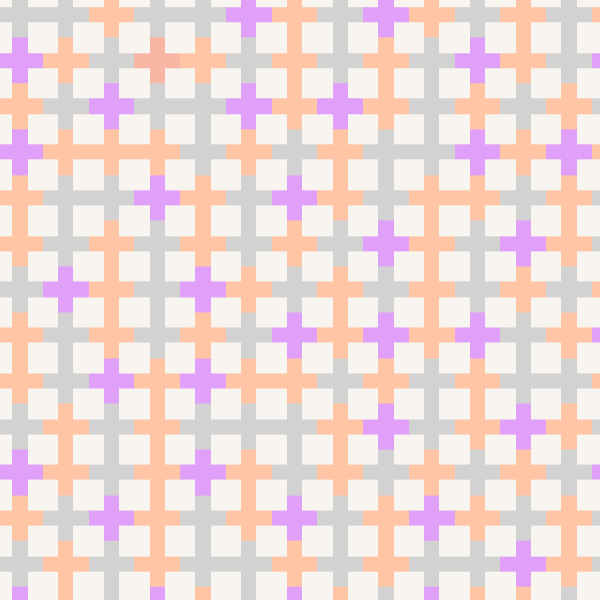
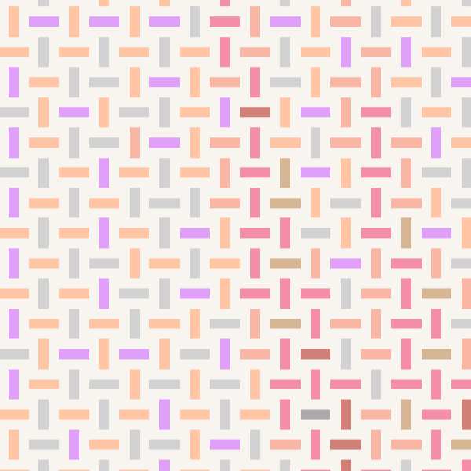
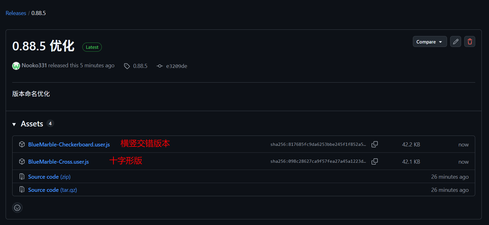
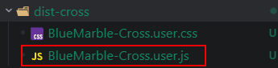
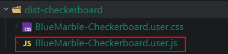

## 该项目已停止更新支持

依然可以使用，后续不再更新。

该项目最初是为了弥补填涂工具的检测算法准确性而设计的，现在填涂工具经过多轮更新，已不再需要搭配该魔改版本的blue marble，使用该blue marble，反而容易导致错判。

如果你使用[wplace_canYouHelpMe](https://github.com/Nooko331/wplace_canYouHelpMe)，不建议使用该工具，而是使用原版blue marble。

## 这是什么？

该项目基于[Bluemarble](https://github.com/SwingTheVine/Wplace-BlueMarble)，在源项目基础上做了一些视觉优化。

## 优化了什么？

修改了原版中小方块的渲染形状，增大识别面积，有2个版本。

### 十字形版本

第一个版本是十字形版本，如下图所示，此版本放弃了美观，只在原版的基础上改进渲染形状，而不进行额外的计算。

优点：性能优秀，不会出现卡顿，且识别面积很大，对手机党友好。

缺点：当同色相连时，边界相连看起来并不是很友好，且如果使用自动涂色，可能导致检测到相连部位的像素点，导致误判。

### 横竖交错版

第二个版本是横竖交错版本，目的是为了解决十字形版本相连导致自动填涂工具误判，识别面积减少，但是对人眼识别友好，且可以大幅减少自动填涂工具的错判。

## 如何安装？

有3种方法，如下：

### release页面直接下载

### 从仓库中

**十字形版本**放在**dist-cross**文件夹下，将**BlueMarble-Cross.user.js**文件拖入到**Tampermonkey**的控制面板安装。

**横竖交错版本**放在**dist-checkerboard**文件夹下，将**BlueMarble-Checkerboard.user.js**文件拖入到**Tampermonkey**的控制面板安装。

### 下载整个项目并自行打包

也可以将该项目下载后，安装依赖，运行`npm run build`，自行打包并安装，打包后文件位置同上。
